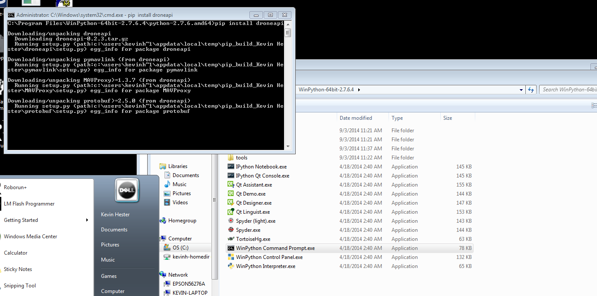

# Installing
The DroneAPI is available in the public pypi repository.  Therefore on essentially any machine that run python you can use the pip tool to install.

## Linux
If you are Ubuntu you can get pip (and other required dependencies) by running:

    sudo apt-get install pip python-numpy python-opencv python-serial python-pyparsing python-wxgtk2.8
    sudo pip install droneapi

## OS X
Install WXMac

    brew install wxmac

Install the following python libraries

    pip install numpy pyparsing

On OSX you need to uninstall python-dateutil since osx comes bundled with a version that is not supported for some dependencies

    pip uninstall python-dateutil

Finally try installing the droneapi:

    pip install droneapi

## Windows
The windows installation is a little more involved, but not too hard.

You could install the various python libraries by hand, but we think that it is easier to use the WinPython package, the steps to install this package and our add-on modules are:

1. Run the correct WinPython installer for your platform (win32 vs win64)
2. Register the python that came from WinPython as the preferred interpreter for your machine:

    Open the folder where you installed WinPython, run "WinPython Control Panel" and choose "Advanced/Register Distribution".

3. Run "WinPython Command Prompt" and run the following two commands:

    pip uninstall python-dateutil
    pip install droneapi

4. Done!, You can now run "mavproxy.py -master=COM3" (etc...) as needed in the tutorial steps.

# Installing the example code

For this tutorial you’ll probably want the example files contained within the package source, to get those examples:

    git clone http://github.com/diydrones/droneapi-python.git

